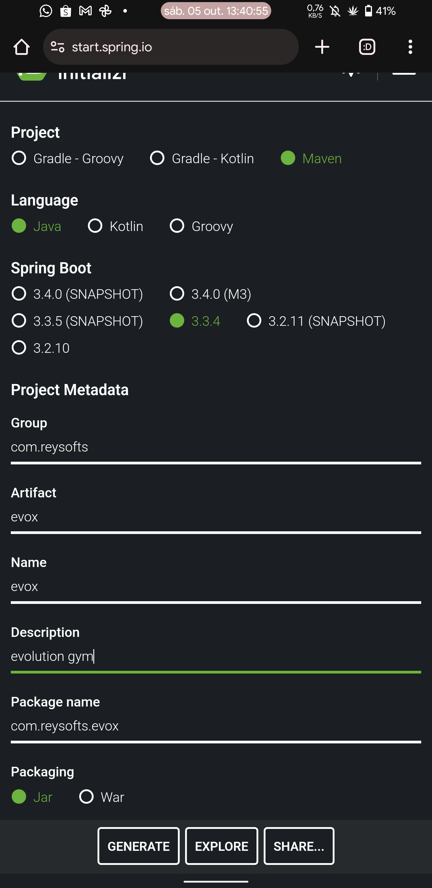

*sab, 05 out. 13:38, 2024*
## passos de criação
Para construir ele foi muito simples! <br>
fui no site do spring e criei na seguinte config:
<br>

<br>
Depois, exportei ele no diretorio principal do cel, e o movi para a pasta raiz, pq achei que ia ser melhor a compilação ali.<br>
depois instalei pelo ubuntu, o maven para poder rodar ele, verifiquei qual versao do openjdk estava instalado (21). <br>
Seguir o exemplo do spring pra mvc e deu erro.<br>
o fix do erro se encontra neste <a href='https://chatgpt.com/c/67016555-7684-8011-be7e-45524a8edd5c'>chat do gpt</a>.
depois, usei o `mvn spring-boot:run` para compilar e rodar, e com isso, vai suave.<br>
<br>
### testes de criação e geraçäo de pacotes .jar
<br>
Ele tbm oferece comandos de criação .jar e compilar testes:<br>

```sh
mvn clean package
```
Depois que vc fizer isso, eh soh rodar algo parecido com:

```sh
java -jar target/evox-0.0.1-SNAPSHOT.jar
```
que ele vai rodar o msm sistema pelo proprio java, soh que testado e compilado.
<br>
<hr>

